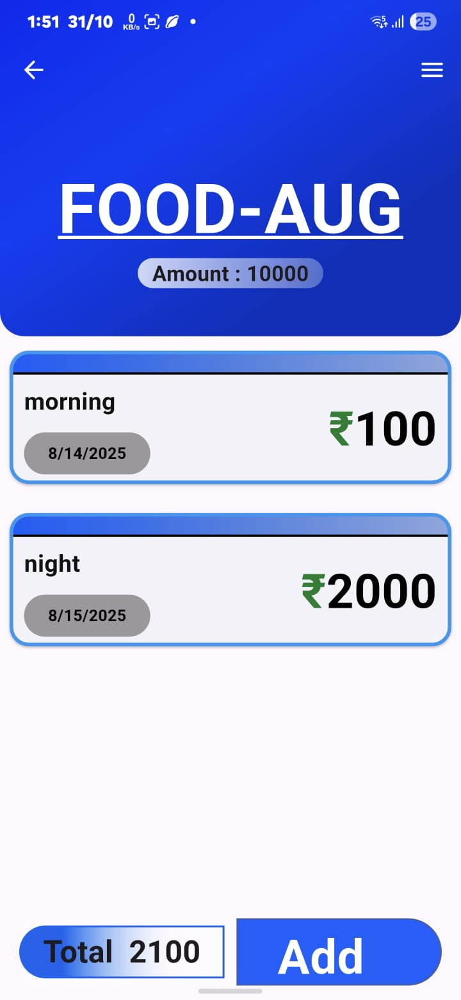
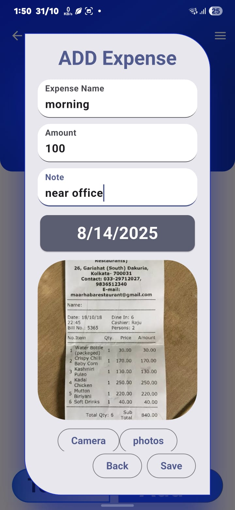
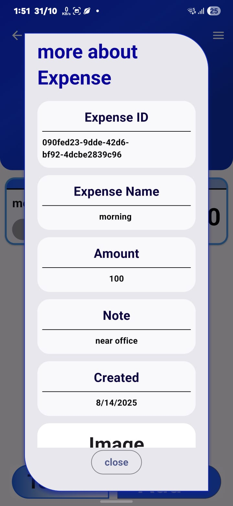

# ExpensifyX

> A clean, cross-platform Flutter expense manager — local-first (SQLite) with optional Supabase cloud sync and image storage.

A simple expense tracker that organizes wallets and their expenses. Data is stored locally (SQLite) with optional two-way sync to Supabase. Images (receipts/screenshots) may be uploaded to Supabase storage.

Highlights
- Local-first: fast, offline-capable app backed by SQLite (DbSql.dart)
- Optional cloud sync: Supabase integration (DbSupabase.dart) for remote backup and image storage
- Image support: upload/download receipts and show them in the UI
- Clean UI with reusable widgets and responsive screens (SliverAppBar + CustomScrollView)

Quick links
- App entry: lib/main.dart
- Local DB & sync: lib/DbSql.dart
- Supabase integration: lib/DbSupabase.dart
- Models: lib/walletModel.dart, lib/expensemodel.dart
- Screens & widgets: lib/Screen/homeScreen.dart, lib/Screen/walletScreen.dart, lib/Widgets/*

Screenshots
(Images are included in the repo root. They are shown here as screenshots of the app.)

Home / Wallet list

Wallet details (expenses and totals)

Add Expense / Receipt preview

Edit Wallet / Edit Expense

Overview / Summary bars

More screenshots

Note: If images appear large on GitHub, you can change display size using HTML  tags with width attributes (e.g. ).

Getting started (development)
1. Install Flutter (see https://docs.flutter.dev/get-started).
2. Clone the repo and open it in your editor:
   - git clone https://github.com/MR-Coder2k04/ExpensifyX.git
3. Fetch packages:
   - flutter pub get
4. Configure Supabase (optional — for cloud sync & image storage):
   - Create a Supabase project and enable storage and tables used by the app.
   - Provide keys to the app (e.g., via a .env or by initializing Supabase in main.dart):
     - SUPABASE_URL
     - SUPABASE_ANON_KEY
   - If you skip Supabase, the app will still work locally using SQLite.
5. Run:
   - flutter run

Architecture summary
- DbSql.dart: Opens/creates the local SQLite DB; CRUD operations for wallets and expenses; local/remote sync helpers.
- DbSupabase.dart: Handles Supabase auth, syncing tables, and storage uploads/downloads for images.
- Models: Walletmodel and Expensemodel — single responsibility objects representing your domain data.
- UI: Home screen lists wallets; tapping a wallet opens walletScreen with expenses and totals. Add/edit flows use reusable widgets in lib/Widgets.

Tips
- Local-first design — changes are saved to SQLite first, then synced to Supabase when configured/available.
- Sync logic attempts to merge records (adds missing cloud items locally, and reconciles deletions).
- Images in the repo are sample screenshots; use the app's camera/gallery pickers to attach receipts.

Contributing
- Bug reports and pull requests are welcome. Please open an issue describing the problem before submitting major changes.
- Keep UI and business logic separated when possible. Add tests for core sync and DB logic where appropriate.

License
This project is provided under the MIT License. See LICENSE for details.

Contact
- Maintainer: MR-Coder2k04
- Repo: https://github.com/MR-Coder2k04/ExpensifyX
